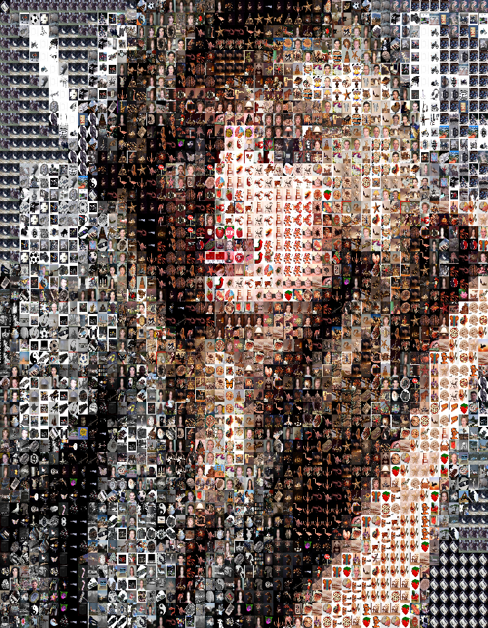

# Mosaic Image Generation — Documentation

## Project Overview / Architecture

The application is a C# (.NET 8) console tool that recreates a target image as a photo mosaic built from a library of thumbnail images (Caltech-101 dataset).

The architecture is a linear pipeline inside a single static `Program` class, with each stage implemented as one pure-ish function:

1. **Cache** (`populateThumbnailCache`) — scans the thumbnail directory once, computes each image's average RGB color, and persists the results to `cache.json` so ~10,000 images are not re-analyzed on every run.
2. **Chunking** (`GenerateChunks`) — splits the target image into an n×n grid of tiles.
3. **Analysis** (`AverageColor`) — computes the average color of each tile.
4. **Matching** (`BestFitThumbnails`) — selects the closest thumbnail per tile using CIE76 Delta-E color distance (via ColorMine), which matches perceived color better than raw RGB distance.
5. **Stitching** (`StitchMosaic`) — draws each selected thumbnail scaled into its grid cell.

A pipeline structure was chosen because the problem is inherently sequential and each stage has a single, testable responsibility with simple data (lists of bitmaps, colors, paths) flowing between them. Configuration is exe-relative by default and overridable via CLI flags (`--target=`, `--chunks=`, …), so the tool is portable as a self-contained executable.

## Example

| Target image | Generated mosaic (50×50 tiles) |
|:---:|:---:|
|  |  |

*Each tile of the right-hand image is an individual photograph from the Caltech-101 dataset, selected by closest average color (CIE76 ΔE) to the corresponding region of the target.*

## Protocol of Incremental Progress

Development followed the commit history: `init` → `average color of an image` → `chunking` → `thumbnails` → `mosaic`.

**Milestone 1 — Image analysis and chunking** (commits `average color of an image`, `chunking`).
The foundation was per-pixel color analysis (`AverageColor`) and splitting the target into an n×n grid (`GenerateChunks`). The technical challenges were avoiding integer overflow when summing pixel channels over large images (solved with `ulong` accumulators) and the correct use of `Graphics.DrawImage` source/destination rectangles — copying a moving source region of the target into a fixed-size tile, with grid math (`img.Width / nChunks`) and a consistent column-major tile ordering that later stages must reproduce exactly.

**Milestone 2 — Thumbnail library, caching, and best-fit matching** (commit `thumbnails`).
Scaling the color analysis to a ~10,000-image dataset (Caltech-101) made per-run analysis infeasible, so results are computed once and persisted to `cache.json` via `System.Text.Json`. Matching each tile to a thumbnail required a perceptually meaningful color distance: plain RGB Euclidean distance ranks colors poorly against human perception, so the ColorMine library's CIE76 Delta-E comparison was used for nearest-color selection.

**Milestone 3 — Mosaic assembly and resource management** (commit `mosaic`).
The stitcher inverts the chunking transform, scaling each selected thumbnail into its grid cell. Two hard-won lessons: first, `DrawImage` only *scales* when the source rectangle spans the full source bitmap and the destination rectangle has the cell size — the initial version accidentally cropped thumbnail corners and sized the output from a thumbnail's resolution, producing a 220 MB image. Second, `System.Drawing.Bitmap` wraps unmanaged GDI+ memory the garbage collector barely sees; bitmap lifetimes were therefore made explicit — chunks disposed immediately after averaging, thumbnails loaded and disposed per loop iteration via `using var`, and the stitcher redesigned to take file paths instead of pre-loaded bitmaps, keeping peak memory independent of grid size.

## Test

Testing was performed as manual end-to-end runs against known inputs, verifying each pipeline stage through its observable output:

- **Functional correctness:** generated mosaics were visually compared against the target image at multiple grid sizes (8×8, 50×50, 100×100, 150×150) — the mosaic must reproduce the target's large-scale structure and color regions, with individual tiles recognizable as distinct photographs. Output dimensions were verified to equal `(targetWidth/n)·n × (targetHeight/n)·n`.
- **Cache behavior:** first run builds `cache.json` from the thumbnail directory; subsequent runs load it without re-analysis (verified via console output and run time). Deleting the cache triggers a rebuild.
- **CLI overrides:** each flag (`--target=`, `--thumbnails=`, `--cache=`, `--output=`, `--chunks=`) was tested individually and combined; invalid `--chunks` values (non-numeric, zero, negative) exit with an error message. Unknown flags exit with a usage hint.
- **Output naming:** repeated runs produce `output.png`, `output_1.png`, `output_2.png`, … without overwriting.

### Runtime performance

Measured with `System.Diagnostics.Stopwatch` around each pipeline stage (Release build, self-contained win-x64). Thumbnail library: Caltech-101, ~9,100 images.

| Stage | 25×25 (625 tiles) | 50×50 (2,500 tiles) | 100×100 (10,000 tiles) |
|---|---|---|---|
| Cache build (first run only, grid-independent) | 203.4 s | 203.4 s | 203.4 s |
| Chunking | 0.1 s | 0.1 s | 0.2 s |
| Average colors | 0.2 s | 0.1 s | 0.2 s |
| Best-fit matching | 1.2 s | 4.3 s | 17.8 s |
| Stitching | 0.4 s | 1.4 s | 5.6 s |
| **Total (cached)** | **1.9 s** | **5.9 s** | **23.8 s** |

A repeated 50×50 run produced near-identical timings (4.3 s matching, 1.4 s stitching), confirming measurement stability. The measurements match the complexity analysis: matching scales quadratically with grid size and linearly with library size — O(n² · m), one full library scan per tile — growing ~4× per grid-size doubling (1.2 → 4.3 → 17.8 s) and dominating total runtime. Stitching shows the same ~4× quadratic growth, as thumbnail decodes equal the tile count. Chunking and color averaging are effectively constant across grid sizes, since the total pixel count they process (the whole target image) is independent of how finely it is subdivided. The one-time cache build dominates the first run (~9,100 thumbnails analyzed per-pixel via `GetPixel`), which is precisely what the persistent cache amortizes away.

**Test data provided with the submission:** the target image (`docs/example-target.jpg`), a generated result (`docs/example-output.png`), and the thumbnail dataset reference (Caltech-101, <https://www.kaggle.com/datasets/imbikramsaha/caltech-101>) with the generated `cache.json`.

## Proof of Edge Cases

**Most challenging edge case: a stale thumbnail cache after relocating the thumbnail library (a data-consistency/format error).**

`cache.json` stores *absolute* file paths for each analyzed thumbnail. If the thumbnail directory is moved, renamed, or the cache is copied to another machine, the cache deserializes successfully and all color data remains valid — but every stored path points to a file that no longer exists. The failure is deferred and misleading: the pipeline runs through analysis and matching normally and only crashes deep inside stitching, when GDI+ attempts to load a selected thumbnail and throws its generic `ArgumentException: Parameter is not valid` (GDI+ maps I/O failures, decode failures, and invalid arguments onto the same exception, with no path information). The bug is also *intermittent from the user's perspective*: it only manifests when a stale path is actually selected as a best-fit winner, which depends on the target image — this made it genuinely difficult to diagnose.

**Handling:** the cache is validated at load time. After deserialization, the program probes whether the cached thumbnail paths still exist on disk; if not, it reports the cache as stale, rebuilds it from the configured thumbnail directory, and reloads. Cache invalidation is also available manually (delete `cache.json`) and per-run via the `--cache=` flag, which allows separate caches for separate thumbnail libraries.

**Technical justification:** validation happens at the single choke point where cached data enters the pipeline, which is the earliest moment staleness is detectable — failing (and self-healing) there converts a cryptic GDI+ crash after minutes of processing into an immediate, explained rebuild. Probing the first cached path is used as a representative check: relocation invalidates all paths simultaneously, so one probe detects the condition at zero cost; exhaustive per-file probing was rejected as ~10,000 filesystem hits on every start to detect a condition that is all-or-nothing in practice. Rebuilding automatically (rather than merely erroring) is justified because the rebuild is deterministic, needs no user decision, and the one-time cost is preferable to a crash with an unactionable message. **Known limitation:** the single-probe check targets wholesale relocation and does not detect *individual* changes to the library — a single deleted or renamed thumbnail passes validation (and crashes only if it is selected as a best-fit winner), and newly added images are not picked up until the cache is manually invalidated (delete `cache.json` or point `--cache=` at a fresh file). Detecting these cases would require the rejected exhaustive probing plus a directory diff on every start; since the thumbnail library is treated as a static dataset, this cost was not considered justified.

## AI Usage and Audit Log

AI tool used: **Claude (Anthropic)**, via chat, as a pair-programming assistant. All AI-suggested code was reviewed, adapted, and integrated manually; the overall design (pipeline stages, ColorMine matching, caching) and the initial implementation were written by me. AI also assisted in drafting and structuring this documentation itself, based on the actual development conversation; the content was reviewed and corrected by me.

### For which parts of the code did I use AI?

- **`StitchMosaic`** — the inverse-drawing logic for reassembly, then the corrected version that scales full thumbnails into grid cells, then the final version using per-iteration `using var` disposal.
- **Resource management** — disposing chunk bitmaps inline after averaging, disposing the target bitmap, and the explanation of `IDisposable`/GDI+ unmanaged memory semantics that motivated these changes.
- **`GetOutputPath`** — incrementing output filenames (`output.png`, `output_1.png`, …).
- **`ParseArgs`** — the CLI flag parsing pattern (`--key=value` with `IndexOf('=')` slicing) including `--chunks` integer validation.
- **Path handling** — switching from user-profile-relative paths to `AppContext.BaseDirectory` + `Path.Combine` for a portable exe.
- **Cache staleness validation** — the load-time probe/rebuild handling described under *Proof of Edge Cases*.
- **Debugging assistance** — interpreting GDI+ exception stack traces; suggesting the try/catch wrapper that prints the failing thumbnail path.
- Not code, but AI-assisted: the `dotnet publish` configuration, the GitHub→GitLab migration procedure, and this documentation.

### Prompt/response documentation

The full transcripts are available; representative excerpts:

| # | My prompt (abridged) | AI response (abridged) | Outcome |
|---|---|---|---|
| 1 | "after chunking an image like this \[code] how do i restitch it" | Provided `Restitch` mirroring my loop order, explained that source/destination rectangles swap and that loop order must match or the image transposes | Adapted into `StitchMosaic` |
| 2 | "can i make it so that the source chunk stretches to the size the chunk SHOULD be" | Explained `DrawImage` stretches when destination rect ≠ source rect; showed target-dimension-based cell computation and `InterpolationMode` | Basis for the scaling stitcher |
| 3 | "it just outputted a 220mb image. the stitching isnt actually shrinking" | Diagnosed both bugs: output sized from `chunks[0]` (a full-res thumbnail) and source rect cropping a corner instead of covering the full thumbnail | Fixed; follow-up questions ("cell width? u mean the chunkwidth?", "am i not already doing that?") clarified that the value must come from the target image in `Main`, not from the passed list |
| 4 | "how do i make the output increment?" | `while (File.Exists(...))` counter loop | Used as `GetOutputPath` |
| 5 | "how do i add a cli override for the paths? … what about _nchunks" | Manual `args` parsing with `--key=value`, `const` → `static` change, validation, and a warning about quadratic cost | Used as `ParseArgs` |
| 6 | "does this auto dispose" | Explained finalizer nondeterminism and unmanaged GDI+ memory; confirmed my version correct, noting the tradeoff (re-decoding duplicate thumbnails) vs. a dictionary cache | I chose the simpler per-iteration disposal version |

### Correction / refinement — concrete example

**A satisfactory solution:** the 220 MB output bug (row 3). I pasted the full program and the symptom; the AI immediately identified the actual root cause — `StitchMosaic`'s parameter was *named* `chunks` but at the call site received full-resolution thumbnail bitmaps, so `chunks[0].Width` silently meant "width of an arbitrary thumbnail," inflating the output to ~96,000 px wide while the corner-cropping source rectangle prevented any scaling. The proposed fix (pass cell dimensions computed from the target image; use each thumbnail's full bounds as the source rect) was correct and I integrated it after a few clarifying questions.

**Where the AI was wrong and how it was corrected:** during an intermittent `ArgumentException: Parameter is not valid` crash (see *Proof of Edge Cases*), the AI's first diagnosis was GDI handle exhaustion at the 10,000-object limit, and its second was intermittent memory pressure. I pushed back with evidence — the program had previously run at 100×100 chunks multiple times — and a later stack trace showed the failure inside `Bitmap..ctor(String filename)`, i.e. while loading a *thumbnail file*, even at only 8×8 chunks. The AI revised its diagnosis to a corrupt thumbnail file *or* stale absolute paths in `cache.json` and supplied a try/catch wrapper printing the failing path. The actual root cause, which I confirmed, was the stale cache: I had moved the application folder without regenerating `cache.json`, so its absolute thumbnail paths pointed at the old location. Regenerating the cache resolved the crash entirely (verified up to 150×150 grids), and the load-time staleness validation was added to prevent recurrence. The episode demonstrates both the value of providing the AI with exact stack traces and the necessity of challenging its hypotheses with observed evidence rather than accepting the first confident explanation.
